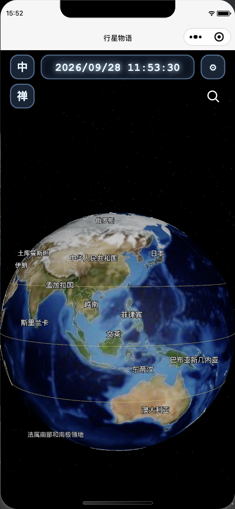
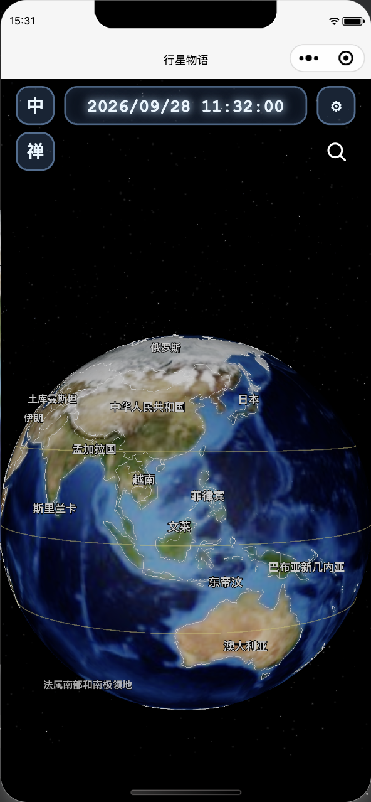
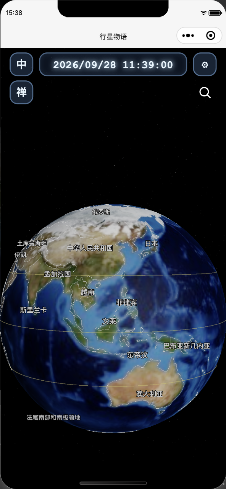
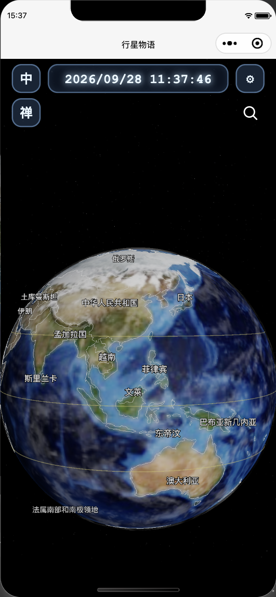
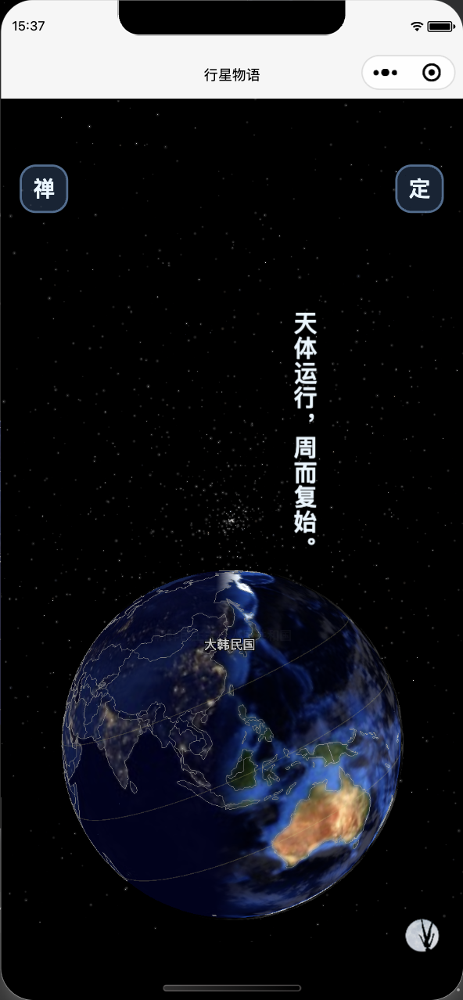

# 当前版本：仅轻微侧光与信息降亮 · 2026-09-28

按用户重新明确的范围，仅做两类小调整：光源向右约 10°、向上约 3°，原有方向光与环境光强度不变；普通星空 opacity 0.60→0.54、size 1.8→1.7、gain 2.2→2.0，国界颜色系数 0.80，非选中国家标签 #ffffff→#eeeeee。选中高亮、云材质、球体材质与贴图未改，未加入球缘光。

实际模拟器验证：普通国界系数 0.80，禅定仍为原有 0.35，退出恢复 0.80；标签在普通/禅定间分别恢复淡白/原白；云层开关和 mesh.visible 均为 false；无蓝色球缘 shader。全部现有 26 个测试文件及 diff 检查通过。

发糊分析：模拟器实际 Earth.map 是 assets/textures/preview-earth.jpg，512×256；本地原始 earth.jpg 为 5400×2700。低清预览是已有清晰度瓶颈，海洋蓝白纹理也存在于底图本身，并非云开关打开的证据。此前同时改动多个视觉变量，缺少逐项对照，无法断言用户看到的新增粗糙感只由球缘光、云材质或低清贴图中的某一项导致。本轮未擅自改贴图加载策略。真机观感仍待用户验收。

---

# 地球轻量视觉微调 · 已撤回

2026-09-28：用户反馈观感变粗糙，本轮光照、星空、蓝色球缘光和云材质改动全部撤回。恢复修改前效果，云层默认关闭，仍由原有云层选项控制。以下截图及验证仅保留为已否决方案的历史记录，不代表当前版本。

本轮先交付普通地球的观感调整，太阳系等用户验收后再启动。

- 普通灯光独立于禅定：轻微右上侧光，保留暗部环境光。
- 普通星空减小星点、亮度与闪烁幅度。
- 地球沿用 Phong，在同一渲染通道加入很薄的蓝色球缘色。
- 云层复用现有灰度纹理作为 alphaMap，以正常透明混合呈现；进入禅定、夜景、登月时恢复原有云材质参数。
- 不新增模型、贴图、绘制通道或小程序依赖。额外着色计算很少，但没有测量真机帧率，不能据此承诺性能完全相同。

## 验证

- PASS：全部 27 个 `tools/*.test.cjs` 测试文件（含新增的模式恢复、贴图刷新、延迟加载、shader 重用检查）。
- PASS：`git diff --check`。
- PASS：微信开发者工具，服务端口 45956，自动化端口 9420；完整重编译后确认普通模式侧光参数、球缘 shader hook 和云层 alphaMap 生效。
- PASS：模拟器切换云层、夜景、禅定，以及返回普通模式；截图已检查。
- DEFERRED：登月入口触发了“登船准备中”，本次短时检查未等到资源加载完成，因此不将登月播放与退出标记通过。已重新加载页面回到普通地球。
- DEFERRED：真机清晰度、流畅度和最终审美验收。模拟器使用现有预览贴图，不代表真机高分辨率资源观感。

开发者工具的热更新曾保留旧实例；使用完整编译后才获得最终截图。截图均来自小程序模拟器。

## 画面

修改前：

修改后（相同初始视角，云层关闭）：

云层开启：

禅定切换检查：

