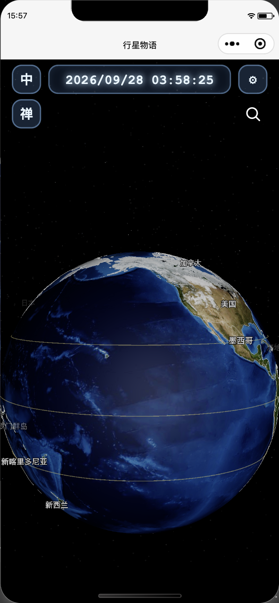

# 清晰度问题定位 · 2026-09-28

当前开发者工具实际使用 512×256 的 preview-earth.jpg，LinearFilter，anisotropy=1，云层不可见。代码本輪两项微调没有更换贴图或采样参数，但先前验收使用低清资源，未排除清晰度瓶颈。

在同一画布、同一视角做控制变量检查：

1. 512 贴图，仅把侧光恢复正面：海洋仍模糊。
2. 恢复轻微侧光，仅换成现有 earth.jpg 生成的 2048×1024 贴图，保持原 UV、过滤和材质设置：海底纹理及海岸线明显清楚。

这确认了当前预览中低清贴图是显著模糊的主要来源。不足以追溯用户更早看到的每一帧所用资源，也不证明此前所有观感变化都只由此导致。

## 当前处理

2K 图由项目根目录 earth.jpg（5400×2700）等比缩小，494288 字节，约 483 KiB。通过既有 __texture_saved_paths_v1 机制安装到开发者工具的 USER_DATA_PATH/textures/earth-preview-2k.jpg，仅更新 earth 键。没有改手机端资源路径，没有把图片加入小程序包，没有撤回轻微侧光及信息降亮。

待解决：运行时替换2K的对照成功；此前自动化会话重建后，读取到的缓存 earth 键为空，画面回退512。再次保存后 getTextureUrl(earth) 已返回2K路径。随后仅用现有窗口普通编译，受到另一路新加入的 paper-airplane.json 模块加载错误阻塞，无法完成持久加载及主题切换验收。不得把临时替换视为持久修复。

范围：修复的是当前开发者工具本地资源缓存。清空小程序文件/缓存后仍可能回到包内 512 兜底；手机真机清晰度未由本次模拟器检查证明。

后续操作约定：优先普通编译，保留当前开发者工具进程及登录状态，不反复关闭、重启或重建自动化会话。

同视角、同侧光的低清与2K对照：

阻塞错误：`module assets/models/paper-airplane.json.js is not defined`，引用来自 `miniprogram/pages/gl/moon-voyage-paper-plane.js`。该文件和模型在本轮验证期间由其他工作加入；本轮未修改它们。

## 后续修复与验收

2026-09-28 用户确认另一个线程停止并授权修复启动阻塞。纸飞机几何数据新增等值 JS 运行模块，原始 JSON 保留；运行引用改为 JS，测试改为解析真实依赖并检查源数据一致性，浏览器预览同步引用。没有修改纸飞机运动或外观。

PASS：现有开发者工具窗口点击普通编译后，地球页面恢复。通过既有自动化连接确认实际纹理 2048×1024，路径 USER_DATA_PATH/textures/earth-preview-2k.jpg；夜景切换返回默认仍为2K，云层关闭，轻微侧光保留。截图 clear-preview.png。27 个测试文件通过，git diff --check 通过。本轮没有关闭/重启开发者工具或重建自动化会话。
